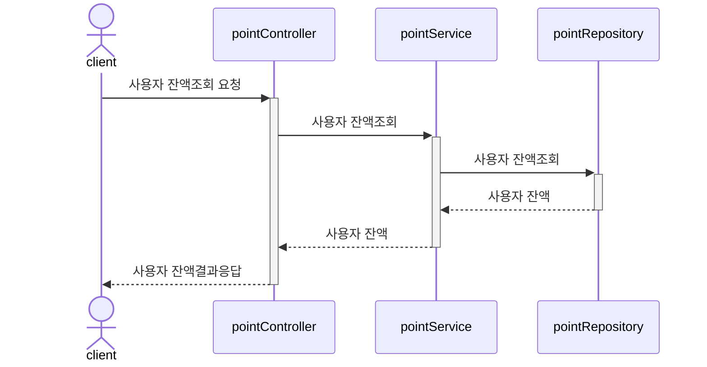

## 잔액조회

```mermaid
sequenceDiagram
actor A as client
participant B as pointController
participant C as pointService
participant D as pointRepository
A->>+B: 사용자 잔액조회 요청
B->>+C: 사용자 잔액조회
C->>+D: 사용자 잔액조회
D-->>-C: 사용자 잔액
C-->>-B: 사용자 잔액
B-->>-A: 사용자 잔액결과응답
```
