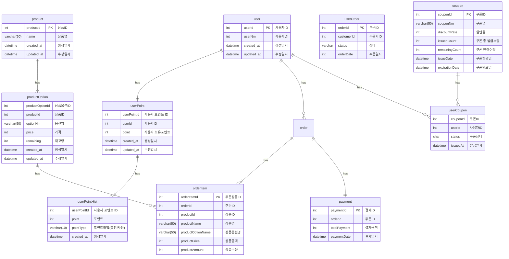

## ERD

```mermaid

erDiagram

    user {
        int userId PK "사용자ID"
        int userNm "사용자명"
        datetime created_at "생성일시"
        datetime updated_at "수정일시"
    }
    
    userPoint {
        int userPointId "사용자 포인트 ID"
        int userId "사용자ID"
        int point "사용자 보유포인트"
        datetime created_at "생성일시"
        datetime updated_at "수정일시"
    }

    userPointHist {
        int userPointId "사용자 포인트 ID"
        int point "포인트"
        varchar(10) pointType "포인트타입(충전/사용)"
        datetime created_at "생성일시"
    }

    product {
        int productId PK "상품ID"
        varchar(50) name "상품명"
        datetime created_at "생성일시"
        datetime updated_at "수정일시"
    }

    productOption {
        int productOptionId "상품옵션ID"
        int productId "상품ID"
        varchar(50) optionNm "옵션명"
        int price "가격"
        int remaining "재고량"
        datetime created_at "생성일시"
        datetime updated_at "수정일시"
    }

    userOrder {
        int orderId PK "주문ID"
        int customerId "주문자ID"
        varchar status "상태"
        int orderDate "주문일시"
    }
    
    orderItem {
        int orderItemId PK "주문상품ID"
        int orderId "주문ID"
        int productId "상품ID"
        varchar(50) productName "상품명"
        varchar(50) productOptionName "상품옵션명"
        int productPrice "상품금액"
        int productAmount "상품수량"
    }
    
    payment {
        int paymentId PK "결제ID"
        int orderId "주문ID"
        int totalPayment "결제금액"
        datetime paymentDate "결제일시"
    }
    
    coupon {
        int couponId PK "쿠폰ID"
        varchar(50) couponNm "쿠폰명"
        int discountRate "할인율"
        int issuedCount "쿠폰 총 발급수량"
        int remainingCount "쿠폰 잔여수량"
        datetime issueDate "쿠폰발행일"
        datetime expirationDate "쿠폰만료일"
    }


    userCoupon {
        int couponId "쿠폰ID"
        int userId "사용자ID"
        char status "쿠폰상태"
        datetime issuedAt "발급일시"
    }

    user ||--|| userPoint : has
    user ||--o{ order : has
    user ||--o{ userCoupon : has
    order ||--|{ orderItem : has
    productOption ||--o{ orderItem : has
    order ||--|| payment : has
    coupon ||--o{ userCoupon : has
    product ||--|{ productOption : has
    userPoint ||--|{ userPointHist : has


```

