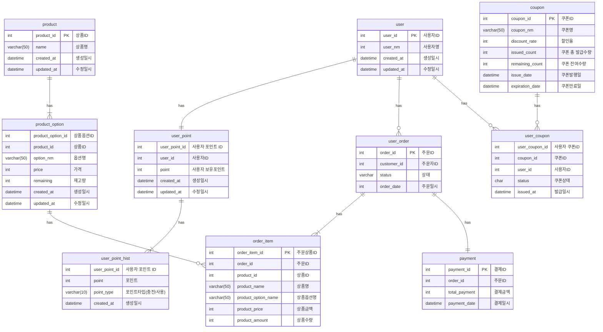

## ERD

```mermaid

erDiagram

    user {
        int user_id PK "사용자ID"
        int user_nm "사용자명"
        datetime created_at "생성일시"
        datetime updated_at "수정일시"
    }
    
    user_point {
        int user_point_id "사용자 포인트 ID"
        int user_id "사용자ID"
        int point "사용자 보유포인트"
        datetime created_at "생성일시"
        datetime updated_at "수정일시"
    }

    user_point_hist {
        int user_point_id "사용자 포인트 ID"
        int point "포인트"
        varchar(10) point_type "포인트타입(충전/사용)"
        datetime created_at "생성일시"
    }

    product {
        int product_id PK "상품ID"
        varchar(50) name "상품명"
        datetime created_at "생성일시"
        datetime updated_at "수정일시"
    }

    product_option {
        int product_option_id "상품옵션ID"
        int product_id "상품ID"
        varchar(50) option_nm "옵션명"
        int price "가격"
        int remaining "재고량"
        datetime created_at "생성일시"
        datetime updated_at "수정일시"
    }

    user_order {
        int order_id PK "주문ID"
        int customer_id "주문자ID"
        varchar status "상태"
        int order_date "주문일시"
    }
    
    order_item {
        int order_item_id PK "주문상품ID"
        int order_id "주문ID"
        int product_id "상품ID"
        varchar(50) product_name "상품명"
        varchar(50) product_option_name "상품옵션명"
        int product_price "상품금액"
        int product_amount "상품수량"
    }
    
    payment {
        int payment_id PK "결제ID"
        int order_id "주문ID"
        int total_payment "결제금액"
        datetime payment_date "결제일시"
    }
    
    coupon {
        int coupon_id PK "쿠폰ID"
        varchar(50) coupon_nm "쿠폰명"
        int discount_rate "할인율"
        int issued_count "쿠폰 총 발급수량"
        int remaining_count "쿠폰 잔여수량"
        datetime issue_date "쿠폰발행일"
        datetime expiration_date "쿠폰만료일"
    }

    user_coupon {
        int user_coupon_id "사용자 쿠폰ID"
        int coupon_id "쿠폰ID"
        int user_id "사용자ID"
        char status "쿠폰상태"
        datetime issued_at "발급일시"
    }

    user ||--|| user_point : has
    user ||--o{ user_order : has
    user ||--o{ user_coupon : has
    user_order ||--|{ order_item : has
    product_option ||--o{ order_item : has
    user_order ||--|| payment : has
    coupon ||--o{ user_coupon : has
    product ||--|{ product_option : has
    user_point ||--|{ user_point_hist : has

```

