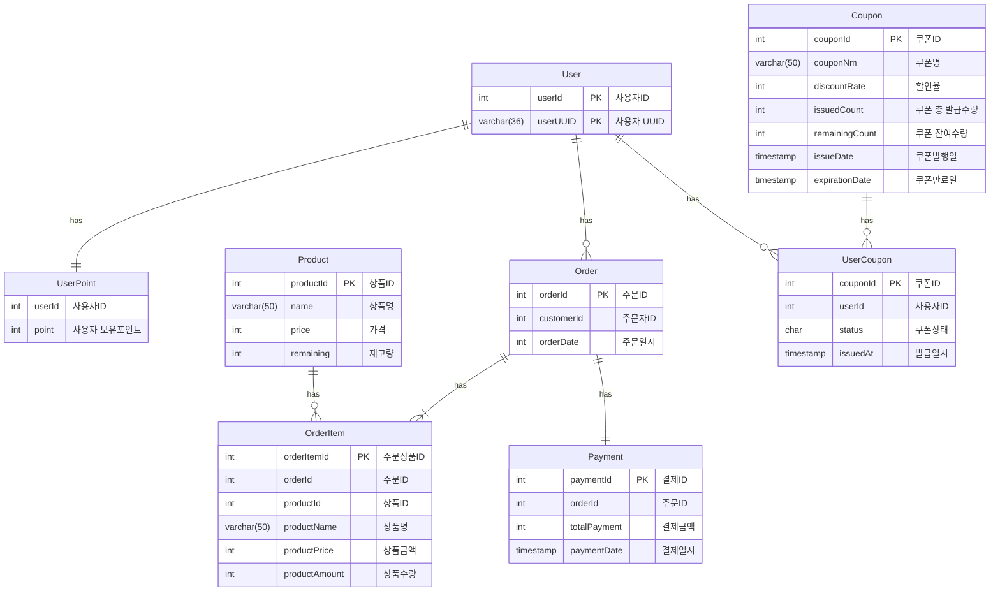

## ERD

```mermaid

erDiagram
    direction TB

    User {
        int userId PK "사용자ID"
        varchar(36) userUUID PK "사용자 UUID"
    }
    
    UserPoint {
        int userId "사용자ID"
        int point "사용자 보유포인트"
    }

    Product {
        int productId PK "상품ID"
        varchar(50) name "상품명"
        int price "가격"
        int remaining "재고량"
    }

    Order {
        int orderId PK "주문ID"
        int customerId "주문자ID"
        int orderDate "주문일시"
    }
    
    OrderItem {
        int orderItemId PK "주문상품ID"
        int orderId "주문ID"
        int productId "상품ID"
        varchar(50) productName "상품명"
        int productPrice "상품금액"
        int productAmount "상품수량"
    }
    
    Payment {
        int paymentId PK "결제ID"
        int orderId "주문ID"
        int totalPayment "결제금액"
        timestamp paymentDate "결제일시"
    }
    
    Coupon {
        int couponId PK "쿠폰ID"
        varchar(50) couponNm "쿠폰명"
        int discountRate "할인율"
        int issuedCount "쿠폰 총 발급수량"
        int remainingCount "쿠폰 잔여수량"
        timestamp issueDate "쿠폰발행일"
        timestamp expirationDate "쿠폰만료일"
    }
    
    UserCoupon {
        int couponId PK "쿠폰ID"
        int userId "사용자ID"
        char status "쿠폰상태"
        timestamp issuedAt "발급일시"
    }

    User ||--|| UserPoint : has
    User ||--o{ Order : has
    User ||--o{ UserCoupon : has
    Order ||--|{ OrderItem : has
    Product ||--o{ OrderItem : has
    Order ||--|| Payment : has
    Coupon ||--o{ UserCoupon : has
```

