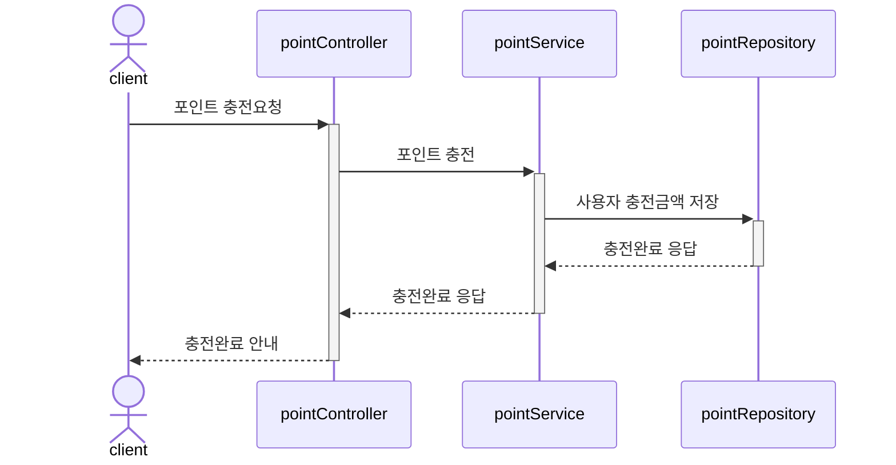

## 잔액충전

```mermaid
sequenceDiagram
actor A as client
participant B as pointController
participant C as pointService
participant D as pointRepository
A->>+B: 포인트 충전요청
B->>+C: 포인트 충전
C->>+D: 사용자 충전금액 저장
D-->>-C: 충전완료 응답
C-->>-B: 충전완료 응답
B-->>-A: 충전완료 안내

```
