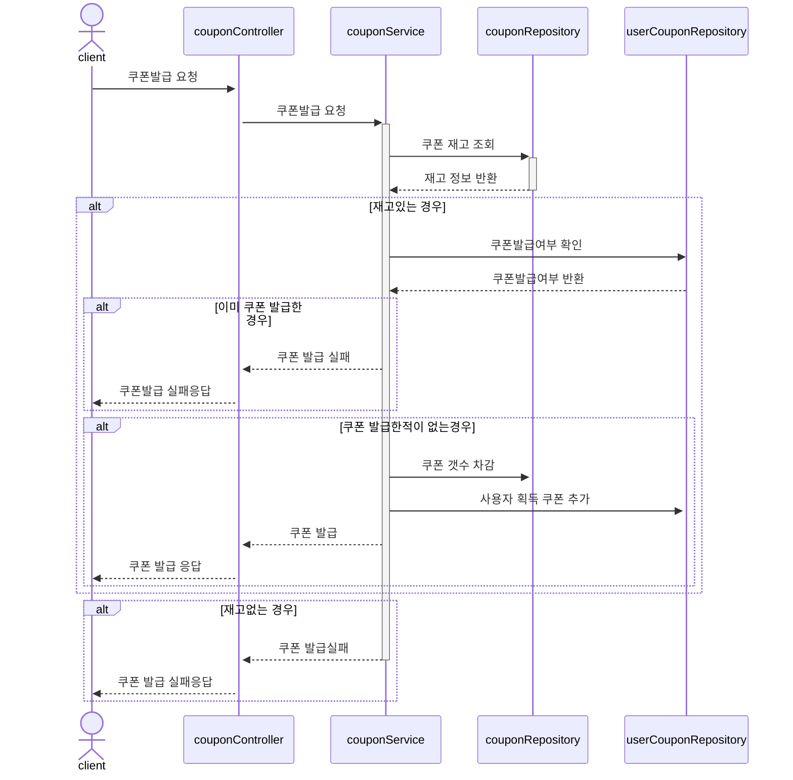

## 선착순 쿠폰 발급

```mermaid
sequenceDiagram
actor A as client
participant B as couponController
participant C as couponService
participant D as couponRepository
participant E as userCouponRepository

A->>+B: 쿠폰발급 요청
B->>+C: 쿠폰발급 요청
C->>+D: 쿠폰 재고 조회
D-->>-C: 재고 정보 반환

alt 재고있는 경우
C->>E: 쿠폰발급여부 확인
E-->>C: 쿠폰발급여부 반환

alt 이미 쿠폰 발급한 경우
C-->>B: 쿠폰 발급 실패
B-->>A: 쿠폰발급 실패응답
end
alt 쿠폰 발급한적이 없는경우
C->>+D: 쿠폰 갯수 차감
C->>+E: 사용자 획득 쿠폰 추가
C-->>B: 쿠폰 발급
B-->>A: 쿠폰 발급 응답
end
end
alt 재고없는 경우
C-->>-B: 쿠폰 발급실패
B-->>A: 쿠폰 발급 실패응답
end
```