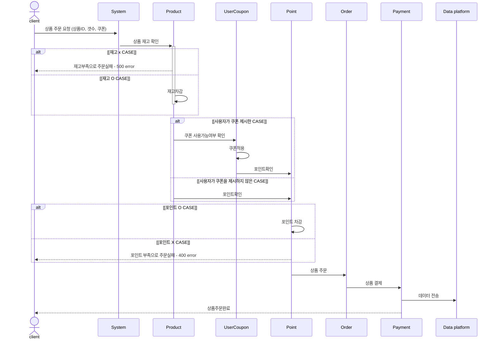

## 주문/결제 

```mermaid
sequenceDiagram
actor A as client
participant B as System
participant C as Product
participant D as UserCoupon
participant E as Point
participant F as Order
participant G as Payment
participant H as Data platform

A->>+B: 상품 주문 요청 (상품ID, 갯수, 쿠폰)
B->>+C: 상품 재고 확인

alt [재고 x CASE]
C-->>A : 재고부족으로 주문실패 - 500 error
else [재고 O CASE]
C->>-C :재고차감
end

alt [사용자가 쿠폰 제시한 CASE]
C->>D: 쿠폰 사용가능여부 확인 
D->>D: 쿠폰적용
D->>E: 포인트확인
else [사용자가 쿠폰을 제시하지 않은 CASE]
C->>E: 포인트확인 
end

alt [포인트 O CASE]
E->>E: 포인트 차감
else [포인트 X CASE]
E-->>A: 포인트 부족으로 주문실패 - 400 error 
end

E->>F: 상품 주문
F->>G: 상품 결제 

G->>H: 데이터 전송
G-->>A:  상품주문완료
```
